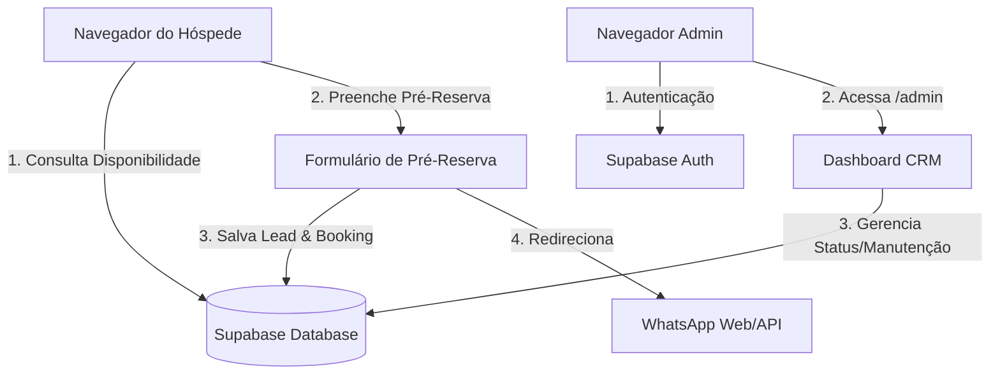

# Estrutura de Pastas Sugerida - Next.js (App Router)

Abaixo está a estrutura de diretórios recomendada para o projeto **Hotel Fazenda Águas Claras**, seguindo as convenções do Next.js 14+ (App Router), TypeScript e Tailwind CSS + Shadcn UI.

```text
fazenda-aguas-claras/
├── public/                     # Arquivos estáticos acessíveis publicamente
│   ├── favicon.ico
│   ├── images/
│   │   ├── logo.svg            # Logotipo da Fazenda
│   │   ├── hero-bg.jpg         # Imagem de fundo da Hero Section
│   │   └── cabins/             # Fotos das 20 cabanas (ex: vale-verde.jpg)
│   └── videos/
│       └── hero-bg.mp4         # Vídeo promocional opcional para a Hero
├── src/
│   ├── app/                    # Rotas e Páginas (App Router)
│   │   ├── (public)/           # Rota paralela/grupo público (sem prefixo na URL)
│   │   │   ├── page.tsx        # Home Page (Hero, Grid Cabanas, Lazer)
│   │   │   ├── cabanas/
│   │   │   │   └── [id]/       # Página de Detalhes da Cabana + Formulário/Calendário
│   │   │   │       └── page.tsx
│   │   │   └── layout.tsx      # Layout público (Navbar, Footer, WhatsApp Flutuante)
│   │   ├── admin/              # Rota privada (Painel CRM)
│   │   │   ├── layout.tsx      # Layout admin (Sidebar, Header de Métricas)
│   │   │   ├── page.tsx        # Dashboard (Dashboard overview de leads e ocupação)
│   │   │   ├── clientes/       # Listagem e Gestão de Clientes (Leads)
│   │   │   │   └── page.tsx    # Tabela rica com filtros e exportação
│   │   │   └── agendamentos/   # Gestão de Reservas e Bloqueios
│   │   │       └── page.tsx    # Visualização em Gantt/Calendário Mensal
│   │   ├── globals.css         # Importações do Tailwind CSS e Variáveis de Tema (CSS Variables)
│   │   ├── layout.tsx          # Root Layout comum
│   │   └── providers.tsx       # Providers (Toast, QueryClient, ThemeProvider)
│   ├── components/             # Componentes React
│   │   ├── ui/                 # Componentes atômicos do Shadcn UI (instalados via CLI)
│   │   │   ├── button.tsx
│   │   │   ├── dialog.tsx
│   │   │   ├── calendar.tsx    # Base do calendário
│   │   │   ├── table.tsx       # Componentes de tabela
│   │   │   ├── badge.tsx       # Status badges (Novo, Pendente, Confirmado)
│   │   │   ├── input.tsx
│   │   │   ├── label.tsx
│   │   │   └── card.tsx
│   │   ├── public/             # Componentes exclusivos do site institucional
│   │   │   ├── hero.tsx        # Hero Section de alta conversão
│   │   │   ├── cabin-card.tsx  # Card individual da cabana no grid
│   │   │   ├── whatsapp-button.tsx # Botão flutuante global
│   │   │   └── availability-calendar.tsx # Calendário dinâmico + Form de reserva
│   │   └── admin/              # Componentes do Dashboard CRM
│   │       ├── sidebar.tsx     # Menu lateral
│   │       ├── stats-cards.tsx # Cards de métricas superiores
│   │       └── occupancy-gantt.tsx # Painel Gantt das Cabanas
│   ├── hooks/                  # Hooks customizados para React Query / Supabase
│   │   ├── use-cabins.ts       # Carregamento de cabanas
│   │   └── use-bookings.ts     # Carregamento e mutações de reservas
│   ├── lib/                    # Configurações de terceiros e utilitários
│   │   ├── supabase.ts         # Inicialização do cliente Supabase (@supabase/supabase-js)
│   │   └── utils.ts            # Utilitário 'cn' para merge de classes Tailwind (clsx + tailwind-merge)
│   ├── services/               # Funções de acesso direto a dados (Database Helpers)
│   │   ├── cabins.ts
│   │   ├── clients.ts
│   │   └── bookings.ts
│   └── types/                  # Definições de tipo TypeScript
│       └── index.ts            # Tipos para Cabin, Client, Booking e Status
├── supabase/                   # Configuração e migrações do Supabase
│   ├── migrations/
│   │   └── 20260702000000_init.sql
│   └── config.toml
├── .env.example                # Variáveis de ambiente de exemplo (Supabase URL e Anon Key)
├── tailwind.config.js          # Configuração do Tailwind CSS
├── tsconfig.json               # Configuração do TypeScript
└── package.json
```

## Arquitetura de Fluxo de Dados


